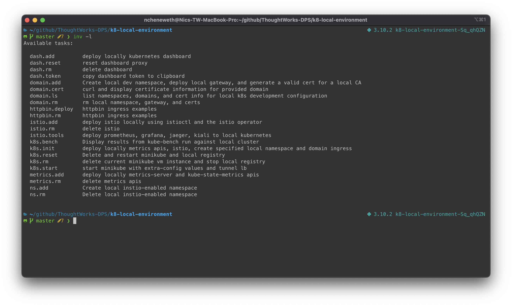

## 1. Getting ready guide  

### Dependencies

**building container images**  


#### local kubernetes related packages used in this setup

[kubectl](https://kubernetes.io/docs/tasks/tools/install-kubectl/) • kubernetes api command-line tool  
[kubectx](https://github.com/ahmetb/kubectx) • cli to quickly swtich between local and remote k8s clusters  
[istioctl](https://istio.io) • istio command-line tool
[helm](https://helm.sh) • manage pod deploys  
[stern](https://github.com/wercker/stern)  • tails logs to the terminal from any number of local or remote pods  
[mkcert](https://github.com/FiloSottile/mkcert) • Automated management of certificates and CA for local https   
[skaffold](https://github.com/GoogleContainerTools/skaffold) • continuous development on local kubernetes  
[kubefwd](https://github.com/txn2/kubefwd) • develop locally with remotes services available as they would be in the remote cluster  
[krew](https://github.com/kubernetes-sigs/krew/) kubectl plugin manager, chiefly for cluster managers   
(_some useful plugins_)  
- _access-matrix_. Show an access matrix for server resources  
- _config-cleanup_. Automatically clean up your kubeconfig   
- _deprecations_. Compare a cluster against a specific version of k8s to reveal any deprecated uses  
- _evict-pod_. Evicts the given pod  
- _exec-as_. Like kubectl exec, but offers a `user` flag  
- _get-all_. Like 'kubectl get all', but everything  
- _images_. List detailed container information for a namespace  
- _konfig_. Merge and manage local kubeconfig*  
- _mtail_. Tail logs from multiple pods matching label*  
- _rbac-lookup_. Reverse lookup for RBAC  
- _rbac-view_. A tool to visualize your RBAC permissions  
- _resource-capacity_. Provides an overview of resource requests, limits, etc  
- _restart_. Restarts a pod with the given name*  
- _roll_. Rolling delete or targted namespaces pods*  
- _view-allocations_. Shows cluster cpu and memory allocations    
- _view-utilization_. Shows cluster cpu and memory utilization  
- _who-can_. like can-i but evaluates who at a permission level  

*installed by the setup script  

_code complete_  
[hadolint](https://github.com/hadolint/hadolint) • Dockerfile lint/inspection   
[kubeval](https://github.com/garethr/kubeval) • k8 yaml lint/inspection  
[git-secrets](https://github.com/awslabs/git-secrets)  

#### scripted setup

**helper scripts**  

Throughout this guide you will also see references to some helper scripts. Python `invoke` and related task files in this repository provide a convenient way to install the various services and examples. Use `invoke -l` to see a list of available shortcuts.  

There is a Pipfile that can be used in setting up a local python virtual environment.  

Scripts are provided that can accelerate the installation process for these tools.  

**install_mac.sh**  

Depends on the [homebrew](https://brew.sh) MacOS package manager.  

**install_windows.sh** (_pending_)  

### Honorable mentions for additional local customization  

You may enjoy using these tools.  

[oh-my-zsh](https://ohmyz.sh)  
[kube-ps1](https://github.com/jonmosco/kube-ps1)  

<p align="center"></p>

[Return](../README.md)

### Configuration for performing signed commits to GitHub

This explanation assumes MacOs and is based on using your personal KeyBase account.  

Use of Keybase is not a requirement for signed commits and there are many posts you can find that describe alternative means. Many people already use other popular keyservers (e.g., pgp.mit.edu, keyserver.ubuntu.com)

Requirements:
* Github account
* Keybase account
* GPG service locally

```bash
$ brew cask install keybase  # typically already installed as part of keybase app install
$ brew install gpg
```

Create new personal key. (Note: you can skip if you already maintain your key via alternative means)
```bash
$ Keybase pgp gen --multi

# If your gpg is running local then you should see the following

Enter your real name, which will be publicly visible in your new key: Jane Doe
Enter a public email address for your key: jdoe@thoughtworks.com
Enter another email address (or <enter> when done): jane.doe@gmail.com
Enter another email address (or <enter> when done):
Push an encrypted copy of your new secret key to the Keybase.io server? [Y/n] Y
When exporting to the GnuPG keychain, encrypt private keys with a passphrase? [Y/n] Y
▶ INFO PGP User ID: Jane Doe <jdoe@thoughtworks.com> [primary]
▶ INFO PGP User ID: Jane Doe <jane.doe@gmail.com>
▶ INFO Generating primary key (4096 bits)
▶ INFO Generating encryption subkey (4096 bits)
▶ INFO Generated new PGP key:
▶ INFO   user: Jane Doe <jdoe@thoughtworks.com>
▶ INFO   4096-bit RSA key, ID 5BE03B7DE63C0271, created 2020-05-25
▶ INFO Exported new key to the local GPG keychain
```

List info needed to setup git locally

```bash
$ gpg --list-secret-keys --keyid-format LONG
/Users/ncheneweth/.gnupg/pubring.kbx
------------------------------------
sec   rsa4096/A8E47CAE38308EC9 2020-05-25 [SC] [expires: 2036-05-21]
      7703E0D1ECF17C64C6B09DDFA8E47CAE38308EC9
uid                 [ unknown] Jane Doe <jdoe@thoughtworks.com>
uid                 [ unknown] Jane Doe <njane.doe@gmail.com>
```

# add to git config

$ git config --global user.signingkey A8E47CAE38308EC9
$ git config --global commit.gpgsign true

# copy to clipboard for pasting into github
keybase pgp export -q 5BE03B7DE63C0271 | pbcopy

# test
export GPG_TTY=$(tty)
echo "test" | gpg --clearsign

# Set as default gpg key
$ $EDITOR ~/.gnupg/gpg.conf

# Add line:
default-key 5BE03B7DE63C0271
```
There are couple different common ways of getting your local config to know to use the key for signing every time. 

```bash
$ brew uninstall pinentry-mac
```

Some people find that pinentry installed with brew does not allow the password to be saved to macOS's keychain.
If you do not see "Save in Keychain" after following Method 1, try the GPG Suite versions, available from gpgtools.org, or from brew by running:

```bash
$ brew cask install gpg-suite
```

Once installed, open Spotlight and search for "GPGPreferences", or open system preferences and select "GPGPreferences." Select the Default Key if it is not already selected, and ensure "Store in OS X Keychain" is checked.


[Return](../README.md)