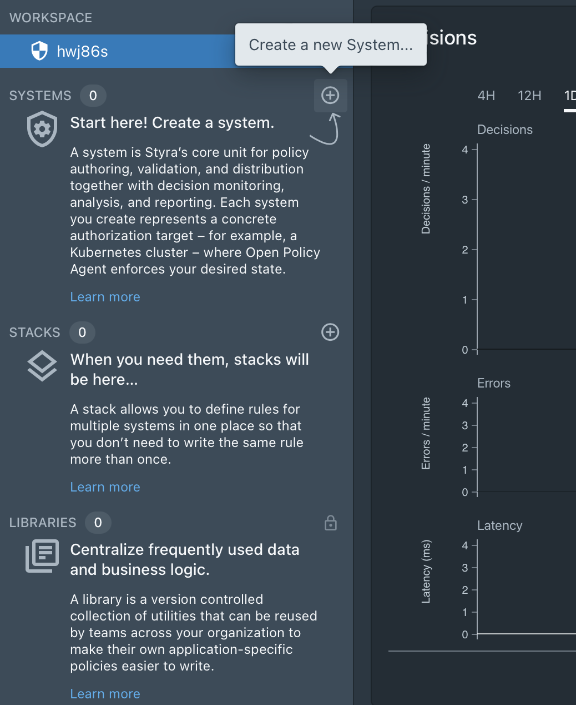
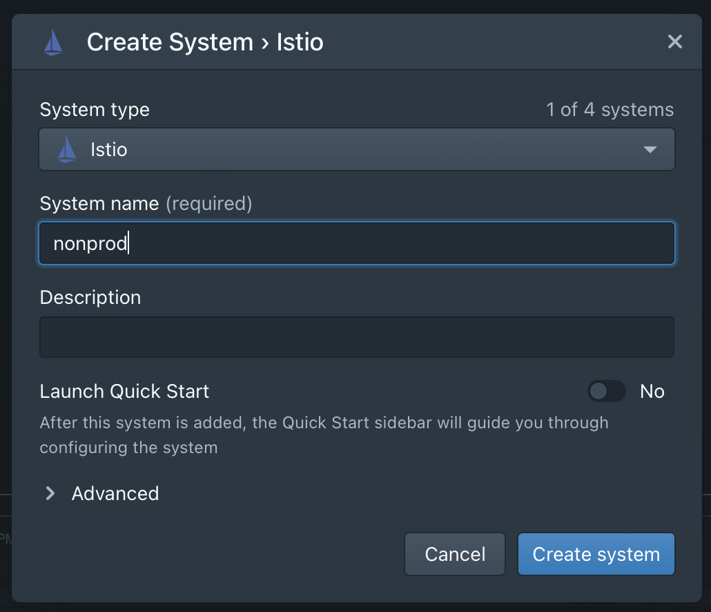
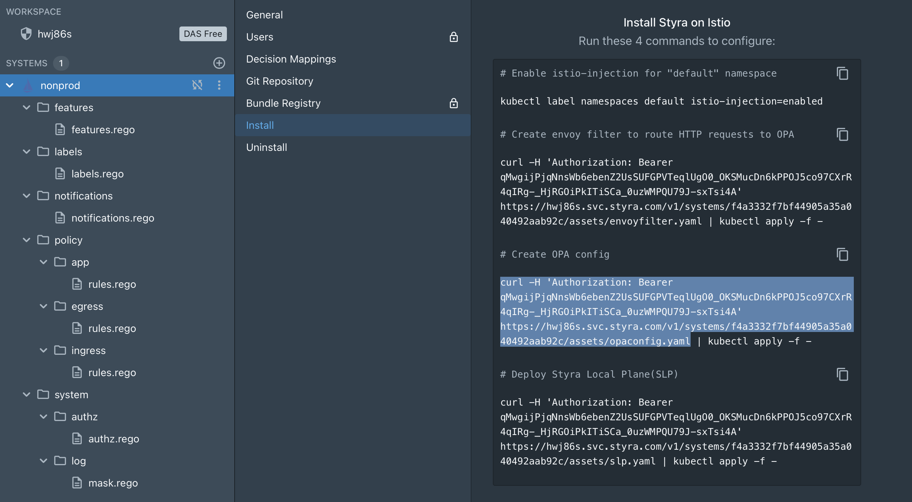
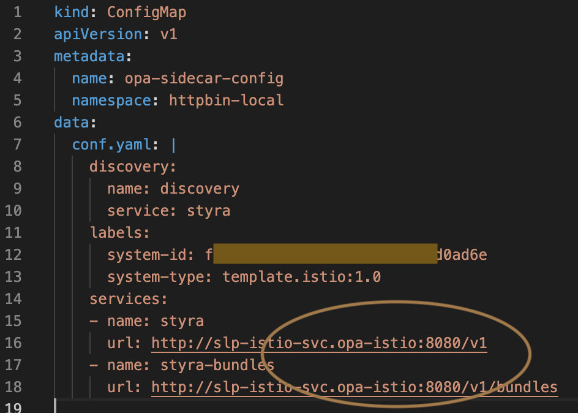
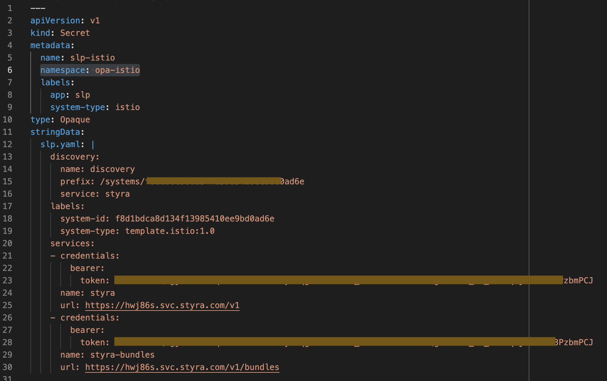
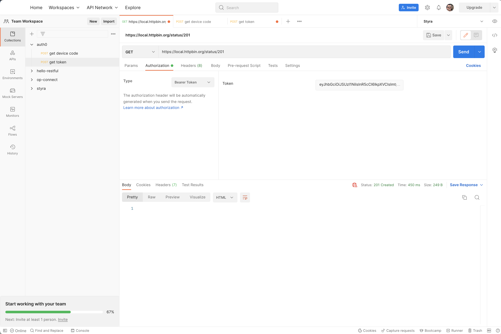

## Example: OpenPolicyAgent with Styra

For the opa example we are going to use the httpbin example code base and expand upon it to include api authz using openpolicyagent and styra integration.  

### step 1

Return to the httpbin example and deploy the tls example. Confirm that you can access the site locally at:  
https://local.httpbin.org  

### step 2

**Styra DAS setup**  

_All steps in this example should be fully automated in pratice, even though the first one is described as a manual process._   

• Create a new System within the DAS interface - select the Istio system type.  

[]  

[]  

• You will information from the `Create OPA config` and `Deploy Styra local plane(SLP)` sections of the install instructions. Select the file reference portion frmo each (one shown) and run the command, piping to a local file.  

[]  

• Edit the OPA configuration file with a new name and namespace:  
```
  name: opa-sidecar-config
  namespace: httpbin-local
```

also modify the service reference to include the opa-istio namespace reference.

[]  

• Name the OPA configuration file as `httpbin-local-add-sidecar-configmap.yaml` and place in the local folder `examples/opa/httpbin-local-additions`  

* From the SLP deployment, grab the secret named `slp-istio` and place in file/folder `example/opa/deploy-slp/slp-styra-access-credentials.yaml`

Add a namespace target to the secret:  
```
  namespace: opa-istio
```

[] 

### step 3

With that setup complete you are ready to deploy and test.  

The basic architecture of this example is as follows.  

**deploy httpbin-local additions**

```bash
$ inv opa.ns
```

Recall from the httpbin example that the httpbin application is deployed to a namespace called `httpbin-local` that has been annotated to indicate that isiot-injection is desired. When anything is deployed to this namespace, istio will include an envoy sidecar and the istio control plane traffic management will be in effect.  

We now want to further annotate the namespace to indicate that an openpolicyagent sidecar should also be deployed.  
```yaml
---
apiVersion: v1
kind: Namespace
metadata:
  name: httpbin-local
  labels:
    istio-injection: enabled
    opa-istio-injection: enabled
```

We also need to deploy an envoy filter to the namespace. This instructs the istio sidecar to direct the incoming request to the opa sidecar before sending the call to the httpbin app. Envoy must receive back an `allowed` response or it will fail the call as unauthorized. (see example filter in the examples/opa/httpbin-local-additions folder)  

Additionally, the opa sidecar injected with our application need the configuration information related to where it will get the policies to be applied. Recall that we added the OPA configuration file to the httpbin-local-additions folder. This tells the opa sidecar to request the policy bundle from the SLP bundle server.  

You must make this changes to any namespace that will require use of OPA. Configmaps cannot be shared across namespaces and we don't want the envoy filtered applied everywhere.  

At this point you should no longer be able to access any of the httpbin actions since istio is configured to attempt an external auth, but there is no opa sidecar available to receive the call.  

**deploy Styra local plane**

Next, deploy the Styra local plane (SLP). This acts as a bundle server to all opa sidecars in a cluster that are configured to use it. The SLP connects to the System we created in Styra and pulls the policies from there, constantly updating to make sure it has the latest version.  

```bash
$ inv opa.slp
```

This includes the creation of a namespace called `opa-istio`.

After a successful start you should see the following:  
```bash
NAME                  READY   STATUS    RESTARTS   AGE
pod/slp-istio-app-0   1/1     Running   0          111s

NAME                    TYPE        CLUSTER-IP       EXTERNAL-IP   PORT(S)    AGE
service/slp-istio-svc   ClusterIP   10.107.212.154   <none>        8080/TCP   2m32s

NAME                             READY   AGE
statefulset.apps/slp-istio-app   1/1     2m32s
```

**deploy the admission controller**  

This deployment includes a MutatingWebhookConfiguration. The webhook is configured to look for any CREATE events in namespaces annontated with `opa-istio-injection: enabled`. When a deployment occurs the kubernetes api will call the admission-controller service. The admission controller will _mutate_ the deployment definition, adding the a deployment definition for an opa sidecar that is in turn configured to pull policies from SLP. 

```bash
$ inv opa.ac
```

At this point, you should once again be able to access https://local.httpbin.org. You will also start to see decision records appear in the Styra DAS interface. Upon creating a new System, only `allow=true` rules are defined permitting all access.  

### step 4

Let's test out a couple different set of rules.  

1. Deny all

Go to each of the policy folders and modify the rule to state `allow = false`

Click the Publish button at the top of the screen to distribute the changes.  

You should no longer be able access https://local.httpbin.org.  

2. Example API rules  

Replace the contents of `policies/ingress/rule.rego` file in Styra DAS the contents of `examples/opa/api-rules.rego`. Note that most of the rules are commented out to start.  

Publish the changes.

From this point, use a tool such a Postman to test the rules. Set the authentication to bearer token and use the token given in the file `dpsctl-bearer-token`. This token was taken from a dpsctl login. Auth0 generated the token and in includes a list of the users github team membership from the ThoughtWorks-DPS organization.  

[]  

With the initial uncommented rule, you should be able to perform any HTTP request against the `/status/{status code}` action. No other action should be permitted.  

Now, uncomment all the code below the `# ========================================= shared functions and variables`

Also, uncomment the validate_jwt directive in the '/status' rule. Now, if you do not use the provided bearer token the call will not be permitted.  The validate_jwt function will fetch the public certs from the auth0 app and validate that the bearer token has been signed by auth0.

Finally, uncomment the remaining rules.  

In particular, note that the `/headers` action may only be called by users who are members of the twdps-core-labs-team github team.  

[Return](doc/examples.md)